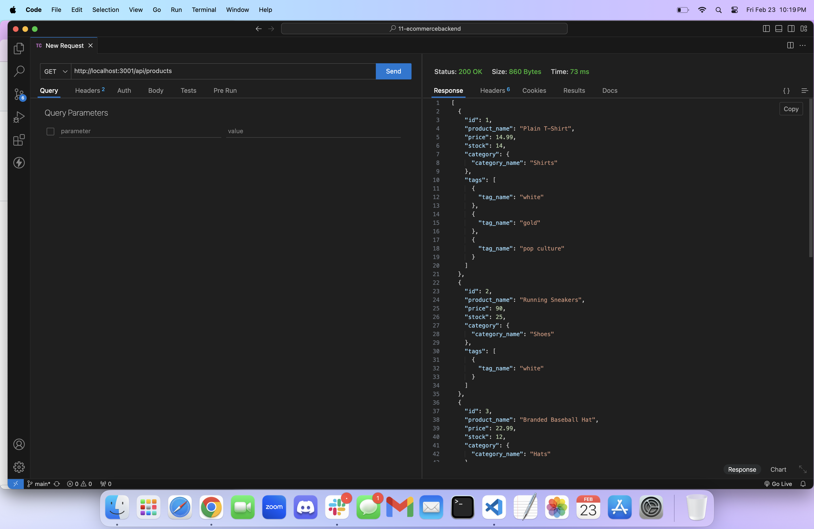
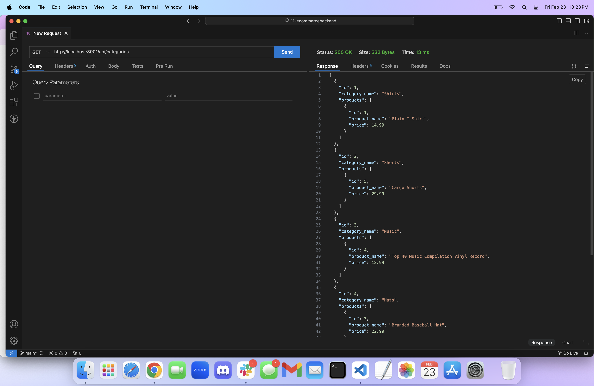
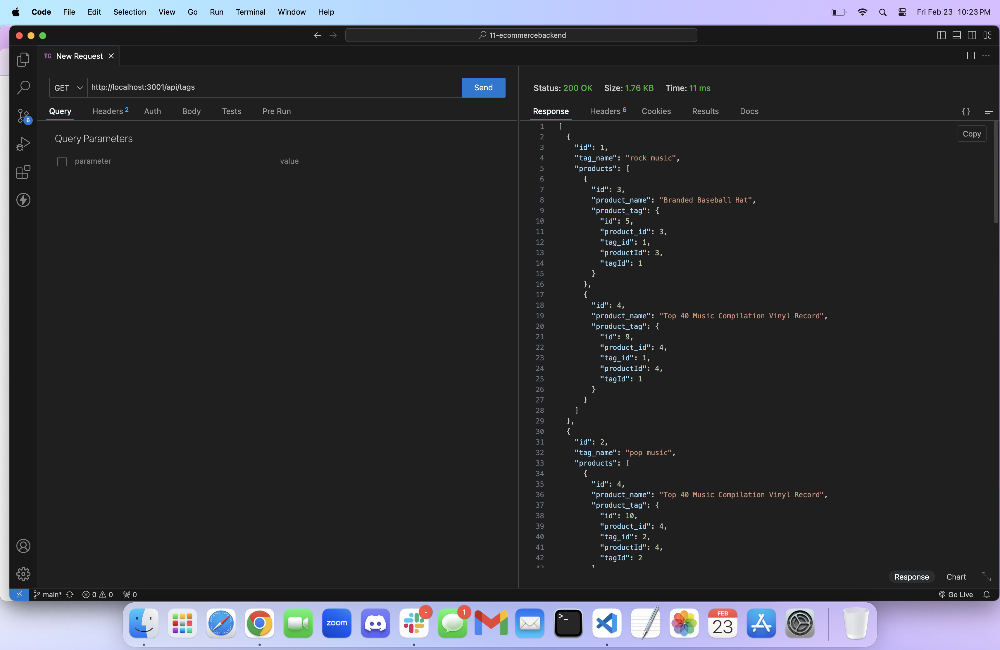

# Challenge 11 - E-commerce Back End
 

## Description
This is a back end for an e-commerce brand. Using JavaScript, Express.js, and Sequelize to interact with the MySQL database to get information about the products, product tags, and categories.

## Table of Contents 
- [Usage](#usage)

- [Credits](#credits)

- [Questions](#questions)

- [License](#license)

## Images/Videos/Links
Here are images of me getting all products, categories, and tags...
For a full video walk-through of me testing GET, PUT, POST, and DELETE on 'Products', 'Categories', and 'Tags' please click [here.](https://drive.google.com/file/d/18wxvT7LWQqa7FmHCo5YQcZbMIEJWHBeH/view?usp=sharing)

[Video Walk-Through](https://drive.google.com/file/d/18wxvT7LWQqa7FmHCo5YQcZbMIEJWHBeH/view?usp=sharing)

## Usage 
To use access the seeded information, clone this repository to your local machine. Then open the integrated terminal in VSCode and run 'npm i' to install the dependencies in the package.json file, after that run 'npm run seed' to seed the database. Now you are ready for 'npm start' which will run the server.js file and run the local server. Now if you have the Thunder Client extension in VSCode, open a new request and put in 'http://localhost:' then whatever port it says in your terminal, and whatever route you want to get for an example: '/products' '/categories' or '/tags'. If you need more guidance on doing this, please refer to my video walk-through linked [here](https://drive.google.com/file/d/18wxvT7LWQqa7FmHCo5YQcZbMIEJWHBeH/view?usp=sharing)!

## Credits
- [npm](https://npmjs.com)
- [Express.js](https://expressjs.com/)
- [mdn web docs](https://developer.mozilla.org/en-US/docs/Web)
- [Thunder Client]()

## Questions
If you have any questions/comments about the project, you can email me at [aleahwhite55@gmail.com](mailto:aleahwhite55@gmail.com). For more of my work you can visit my GitHub at [aleahwhite](https://github.com/aleahwhite)!

## License
This project is licensed under the MIT license. For more information, see the [license page](https://spdx.org/licenses/MIT.html).
